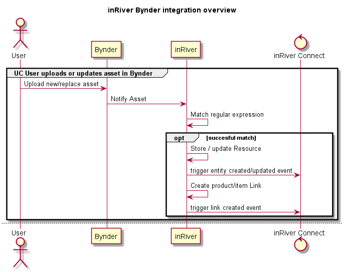
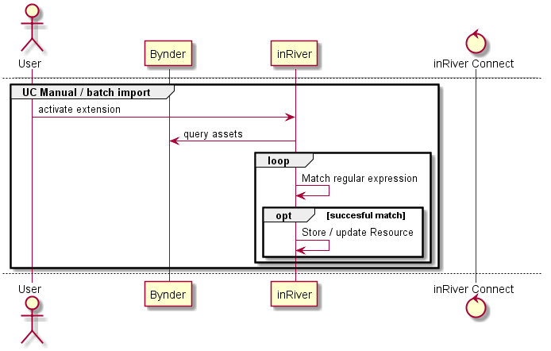
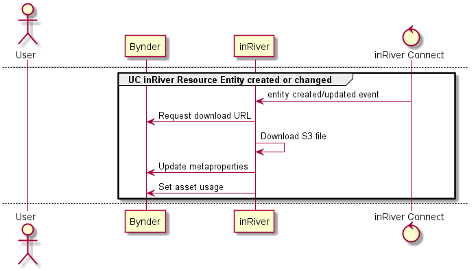
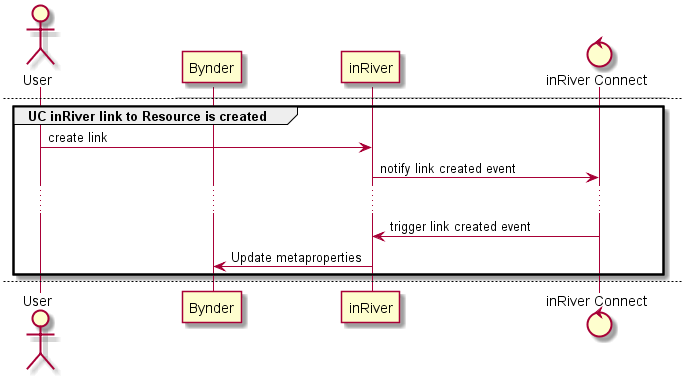
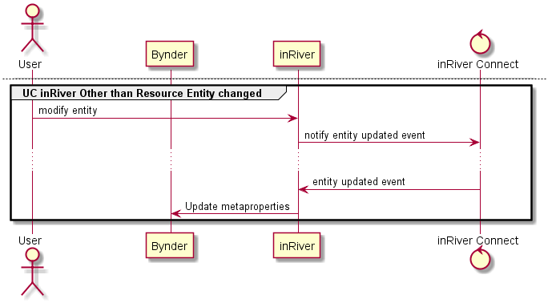

# Bynder - inRiver flows

## UC User uploads or updates asset in Bynder

When an asset is uploaded (newly created or updated) Bynder will send an AWS SNS Notification to inRiver.

The inRiver endpoint defined in `Bynder.Extenstion.NotificationListener` will listen for SNS messages with topics:

* asset_bank.media.uploaded
* asset_bank.media.pre_archived
* asset_bank.media.upload
* asset_bank.media.create

All topics will be treated the same: the Bynder `MediaId` is parsed from the message and starts the [AssetUpdated Worker](#AssetUpdatedWorker)

Notice: property changes in Bynder currently do not trigger any events. Thus only when the file itself is changed it will be notified.

### AssetUpdatedWorker

The AssetUpdated worker, in short, handles the process of newly created or updated. In more detail:

* The original filename is fetched from the Bynder API using `api/v4/media/id/?versions=1` path `.mediaItems[@type = 'original']/fileName`
* The filename is evaluated against the regular expression as configured in `REGULAR_EXPRESSION_FOR_FILENAME`
* When matched it will search for a Resource entity in inRiver which has the field `ResourceBynderId` set to the AssetID from Bynder (a GUID string)
  * If not found: a new Resource entity will be created
* The following values will be set on the Resource entity:
  * `ResourceBynderId` : Bynder Asset ID
  * `ResourceFilename` : filename from Bynder (currently prefixed with the asset ID to keep it unique)
  * `ResourceBynderDownloadState` : "todo" 
* All labeled regex groups starting with `Resource` will be put in matching Resource fields on the Resource entity. With this you can set an inRiver resource value based on parts of the filename
* All labeled regex groups *not* starting with `Resource` will be processed; for each value:
  * A `GetEntityByUniqueValue` search is done to see if there is any entity that matches. E.g. `ProductNumber=12345`
  * If an entity is found and there is a linktype *from* this entitytype to the resource entitytype, e.g. `ProductResource` this link is created.
  * You are able to create multiple links at once, but this is usually not the case as you have to have all the information in the filename.
* inRiver -by default- will raise any events related to the modification, on which other parts of the integration will be triggered. These are not handled here but in the worker extension
* The actual download of the file is also handled in the worker extension.
* End of process

## UC Manual / batch import

The manual import process should be used to initially sync inRiver with Bynder, e.g. when an integration is just setup. This ensures that any asset in Bynder that matches the inRiver configuration will be fetched.

The process is defined in `Bynder.Extension.AssetLoader` and can be named accordingly in the inRiver extension configuration. 

While this is a `IScheduleExtension` the process *ONLY* runs when a user pressed the play button in the Control Center. This is to prevent large running operations subsequently, without the need for this.

The extension will issue a `api/v4/media?query=[INITIAL_ASSET_LOAD_URL_QUERY]&page=[page]&limit=[limit]&total=1` query, replacing the `INITIAL_ASSET_LOAD_URL_QUERY` part with the configured value in inRiver and the pagination options are used internally to paginate through the results. These are not configurable.

Using the initial load query in `INITIAL_ASSET_LOAD_URL_QUERY` it is possible to narrow down the set of assets you want to be processed by inRiver, e.g. only images or assets in a defined collection. This filter does *only* apply to this process.

Any asset found is processed using the [AssetUpdated Worker](#AssetUpdated).
For large collections in Bynder you may assume that this process will take a long time. You can follow its progress by looking at the inRiver Log.

## UC inRiver Resource Entity created or changed

Many events lead to changes on the Resource entity. These events trigger the `Bynder.Extension.Worker` which is both configured as `IEntityListener` and `ILinkListener` to be able to catch all the required events.

The following workers will run:

* [Asset Download worker](#AssetDownloadWorker)
* [Resource Metaproperty Update worker](#ResourceMetapropertyUpdateWorker)
* [Asset Usage Update worker](#AssetUsageUpdateWorker)

### AssetDownloadWorker

This worker is responsible for the actual file download.

* If the `ResourceBynderDownloadState` equals 'todo' the download will proceed
* Download location / URL is requested to Bynder API using `/api/v4/media/{assetId}/download/`, from the result the `.S3_File` location is parsed.
* inRiver is instructed to `UtilityService.AddFileFromUrl` with this URL. The fileId is put in `ResourceFileId`.
* The field `ResourceMimeType` is set to the mime-type based on the file extension
* The `ResourceBynderDownloadState` is set to 'done'.

### ResourceMetapropertyUpdateWorker

This worker is responsible for updating the metaproperties in Bynder, based on values in inRiver.

* The worker is run with shouldSearchForParentEntity=true which allows it to also process entities linking to the resource
* Check if download already succeeded, e.g. `ResourceBynderDownloadState` is set to 'done'
* For each configured mapping in the `METAPROPERTY_MAP`:
  * Mapping e.g.: BynderMetapropertyID=ResourceFieldId
  * If map-value (inRiver fieldname) is on the Resource entity, the value is selected for updating Bynder
* Again, for each configured mapping in the `METAPROPERTY_MAP`:
  * If map-value (inRiver fieldname) is on an (inbound) linked entity the value is selected for updating Bynder.
* Metaproperties are set in Bynder using `/api/v4/media/{assetId}/`

### AssetUsageUpdateWorker 

This worker is responsible for updating the asset usage in Bynder.

* inRiver integration is identified by a fixed GUID, currently `41a92562-bfd9-4847-a34d-4320bcef5e4a`, but check https://help.bynder.com/System/Integrations/asset-tracker.htm for actual value.
* All current usages for the inRiver integration are deleted using `DELETE` on `/api/media/usage/?asset_id={assetId}&integration_id={integrationId}`
* A new asset usage is created using `POST` on `/api/media/usage` with values:
  * asset_id = Bynder Asset ID
  * integration_id = `INRIVER_INTEGRATION_ID`
  * uri = `INRIVER_RESOURCE_URL` in which `{entityId}` is replaced by the inRiver Resource Entity Id.

## UC inRiver link to Resource is created

When a link is created or updated with a resource as Target, the metaproperties worker is called. See [Resource Metaproperty Update worker](#ResourceMetapropertyUpdateWorker).

## UC inRiver "Other than Resource" Entity changed

Many events lead to changes on the Resource entity. These events trigger the `Bynder.Extension.Worker` which is both configured as `IEntityListener` and `ILinkListener` to be able to catch all the required events.

When another entity than of type Resource is changed this may lead to metaproperty changes for linked Resource entities. This is handled in [Non-Resource Metaproperty Update worker](#NonResourceMetapropertyUpdateWorker)

### NonResourceMetapropertyUpdateWorker

This worker is responsible for setting the metaproperties in Bynder, based on values in inRiver, that are on other entities than Resource.

* For each configured mapping in the `METAPROPERTY_MAP`:
  * If map-value (inRiver fieldname) is on an the current entity the value is selected for updating Bynder.
* For each linked Resource entity the [Resource Metaproperty Update worker](#ResourceMetapropertyUpdateWorker) is called with the data already collected from the 'parent' entity.